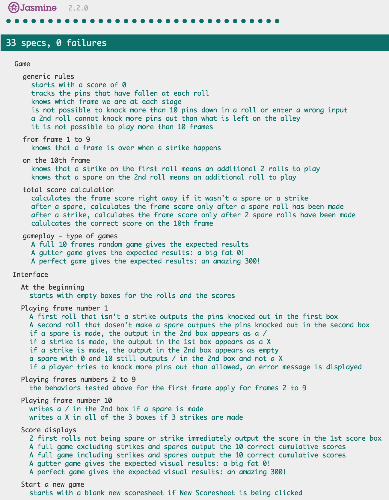

[](https://travis-ci.org/GBouffard/Bowling-challenge) [](https://codeclimate.com/github/GBouffard/Bowling-challenge)

:bowling: Bowling Challenge :bowling:
=================

This project is the week 5 challenge from Makers Academy. The task was to count and sum the scores of a bowling game for one player in JavaScript and make an interface in JQuery.

- A bowling game consists of 10 frames in which the player tries to knock down the 10 pins. 
- In every frame the player can roll one or two times (or 3 in the last frame).
- The actual score of each frame is the number of pins knocked down plus bonuses for strikes and spares. 
- The bonus for a strike is 2 extra roll. The bonus for a spare is 1 extra roll.
- After every frame the 10 pins are reset. 
- The last frame behaves differently and a maximum of 3 rolls can be made if a strike or a spare happens.

It was suggested to test also with a Gutter Game (a Gutter Game is when a player plays a full game and doesn't hit a single pin) and a Perfect Game (A Perfect Game is when the player rolls 12 strikes (10 regular strikes and 2 strikes for the bonus on the 10th frame). The Perfect Game scores 300 points).


Heroku
----
[Guillaume's Bowling Game](http://guillaume-bowling.herokuapp.com/)


Objectives of exercise
----
To learn about Javascript, Jasmine and jQuery.

Technologies used
----
- Javascript
- Jasmine
- JQuery
- HTML, ejs & CSS
- Node.js
- Heroku

How to run it
----
```
git clone git@github.com:GBouffard/Bowling-challenge.git
cd Bowling-challenge
npm install
node server.js
```
By opening your browser on http://localhost:8080/, you can now you can count the score of a game you play.

How to run tests
----
```
cd Bowling-challenge
open SpecRunner.html
```

and this is what you should see:



What can be improved:
----
I over-complicated my approach and debugging such a complicated syntax introduced more and more complicated lines of code. I wished I started differently in the first place to make my life easier but it was a good lesson learnt. I plan to refactor the code or redo this exercise from scratch in the future with a simpler approach. At least, I managed to make it work :smiley: